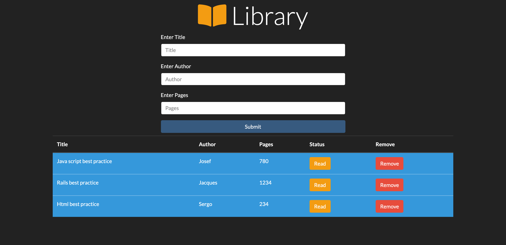

#   Library
Library it's an application where you can add your favorite books, Add if you read them or not , now you can only delete a book and update the read status.

<p align="center">
    
</p>

## Live version of the production comming soon
https://certilremy.github.io/library/

### Feature Currently available:

* Create book
* Edit book status to read or unread
* Delete book

### New features in production :

* Edit book
* Store book on firebase
* Search for book 
* Download book to pdf

## Tech used 
* Html
* CSS (Bootstrap)
* JavaScript

## External library 

* None


## Using the app in development 
Clone this repo (you need Node js installed in your computer).
```
$ git clone git@github.com:certilremy/library.git
```

 Change to the app directory 
 
 ```
$ cd library
 ```

   And run 

```
$ npm install 
```

To start the server you don't need other special server you can go to the project folder ans click the index.html or install live server extention if you're using vsCode

## Author 

* Certil Remy    Github : https://github.com/certilremy
* Tashfeen Rao   Github : https://github.com/TashfeenRao
## Contribution 

If you want to contribute to this project you're welcome .
Follow the github code of conduite fork this repot and open your pull request. 
